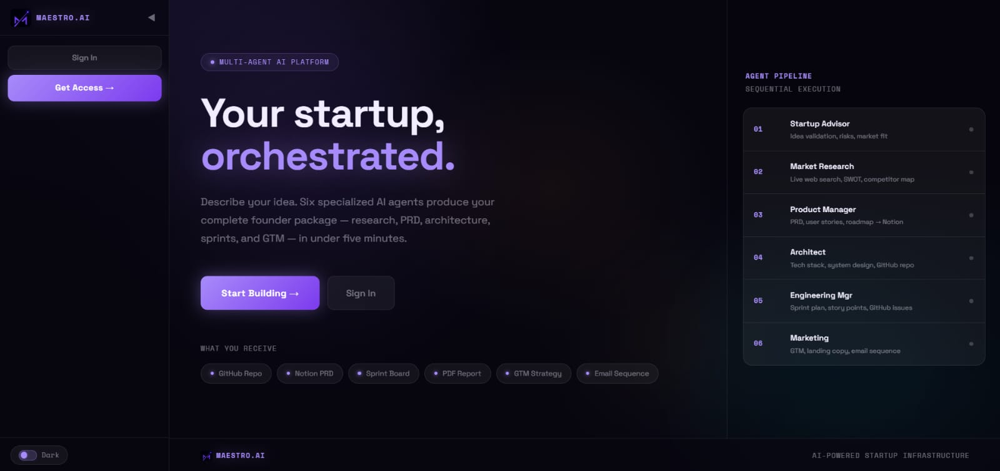
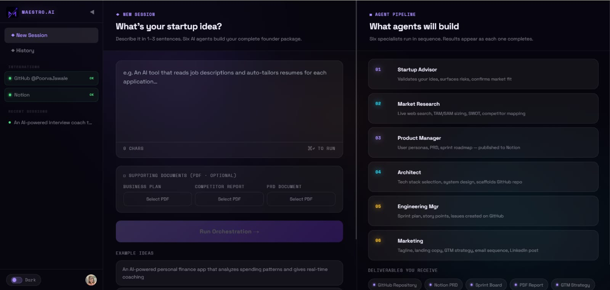
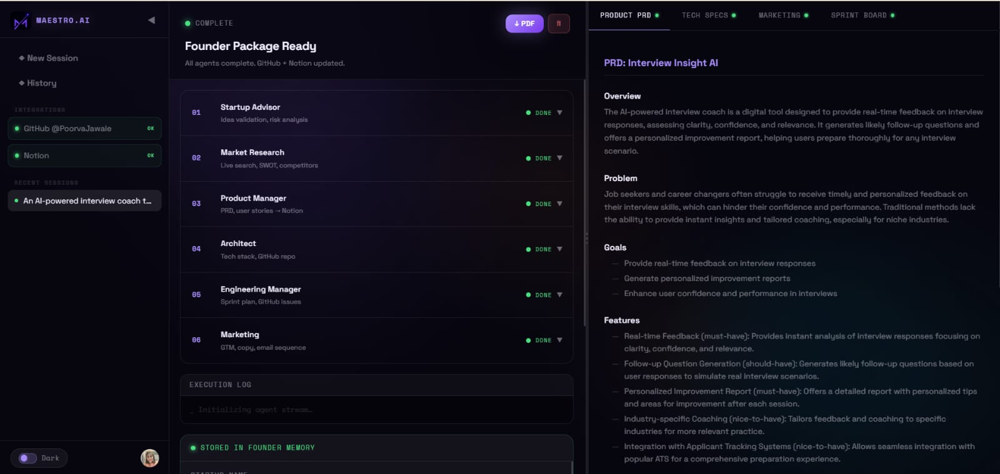
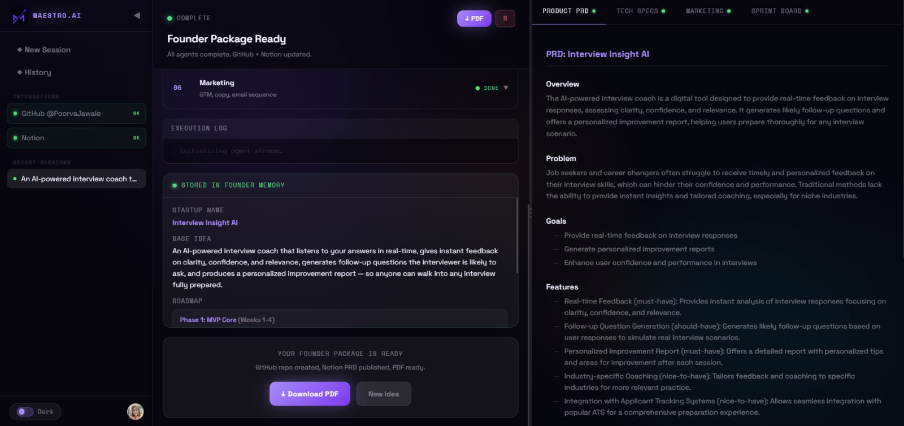
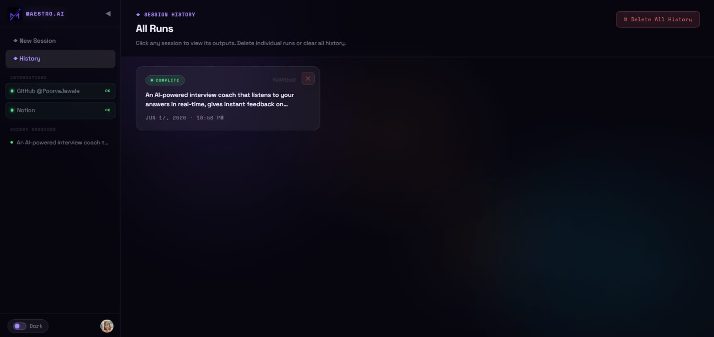

# Maestro.ai

**AI Founder Orchestration System** — turn a raw startup idea into a complete, structured founder package in minutes, using six specialized AI agents that run in sequence.

> **Fully responsive across every device.** The web app is designed to work seamlessly on desktops, laptops, tablets, and mobile phones — layouts, navigation, and the live agent view all adapt fluidly to any screen size.

---

## Project Resources

| # | Resource | Link |
|---|----------|------|
| 1 | Deployed Project | [maestroaipao.vercel.app](https://maestroaipao.vercel.app/) |
| 2 | Live Demo (Recorded) | [Watch on Google Drive](https://drive.google.com/file/d/14bRKqHkHYT4-RcCLzsMEgUvMJQRs2-Nz/view?usp=drive_link) |
| 3 | Technical Documentation | [Open on Google Drive](https://drive.google.com/file/d/18o9GtZvOSa-ngiYNGybg9uUpVfsmmsLr/view?usp=sharing) |
| 4 | Agent Documentation | [Open on Google Drive](https://drive.google.com/file/d/1gv--gA_qgR83nlL_W_fa5jAoKVq_XiyT/view?usp=sharing) |
| 5 | Architecture | [Open on Google Drive](https://drive.google.com/file/d/1lXO0SjXwMZ4Y4-C3pG0G3jN93V0jo1yz/view?usp=sharing) |
| 6 | Presentation (PPT) | [Open on Google Drive](https://drive.google.com/file/d/1upTv2qw6x8b2_JTrJYrfugiG0onh7Sct/view?usp=sharing) |

---

## Overview

Maestro.ai is a multi-agent platform that turns a single sentence — a raw startup idea — into a complete, structured founder package. It is built for someone who is figuring out how to plan a startup and decide what to build first. Instead of assembling validation, market research, a product requirements document, a technology stack, a sprint plan, and marketing by hand across many disconnected tools, the user submits one idea and receives a coherent set of deliverables in a single session, typically within a few minutes.

Under the hood, six specialized GPT-4o agents run in order as a LangGraph pipeline, each building on the output of the agent before it. Progress streams live to the interface over Server-Sent Events. Deliverables are persisted to Neon (PostgreSQL), and every completed session is embedded into Pinecone so that similar past ideas inform future runs. Finished founder packages can be exported to PDF.

### The six agents

1. **Startup Advisor** — validates the idea, flags risks, and gives a clear recommendation.
2. **Market Research** — live web search via Tavily; market sizing, competitor analysis, and a SWOT summary.
3. **Product Manager** — writes the PRD and user stories; can publish to Notion automatically.
4. **Architect** — recommends a technology stack; can create a GitHub repository.
5. **Engineering Manager** — builds a sprint plan; can open GitHub issues from it.
6. **Marketing** — tagline, landing-page copy, go-to-market strategy, and pricing.

### How a session works

1. The user signs in through Clerk and submits a startup idea on the dashboard.
2. A session is created and the six-agent pipeline begins to run.
3. The interface streams each agent's progress live as the run proceeds.
4. Deliverables are saved to Neon, and the completed session is stored in Pinecone memory.
5. The user reviews results on screen, revisits past runs, or exports a PDF.

### Tech stack

| Layer | Technology |
|---|---|
| Frontend | Next.js, Tailwind CSS (Vercel) |
| Authentication | Clerk |
| Backend | FastAPI (Vercel) |
| Orchestration | LangGraph |
| Language model | OpenAI GPT-4o |
| Web search | Tavily |
| Integrations | GitHub (PyGithub), Notion |
| Database | Neon (PostgreSQL) |
| Vector store | Pinecone |
| Observability | LangSmith |
| Deployment | Vercel (both frontend and backend) |

---

## Screenshots

### 1. Landing page

### 2. Dashboard — submit a startup idea and launch the run

### 3. Founder package — deliverables and the generated PRD

### 4. Founder package — marketing output and one-click PDF export

### 5. History — revisit past runs

